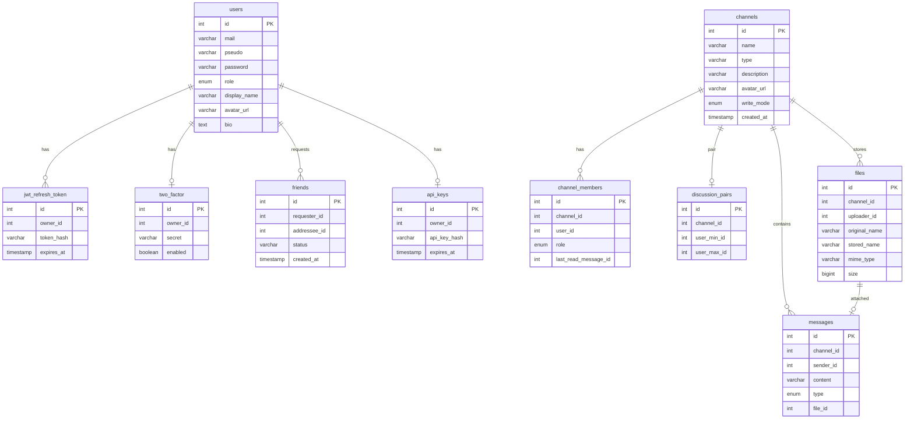

*This project has been created as part of the 42 curriculum by algasnie, jodone, masenche, mgarnier*

# Description

**ft_telegram** is a real-time messaging app: private discussions, groups and channels, friends, profiles and a public REST API.

Users sign up with email and password, can enable TOTP 2FA, chat live over WebSockets, share files, and manage an API key for the documented `/api/users` endpoints. The stack is split into Docker microservices behind Nginx (HTTPS + ModSecurity). Secrets and JWT signing go through HashiCorp Vault. Metrics are scraped by Prometheus and shown in Grafana.

Service-level detail lives next to the code:

- [frontend](srcs/services/frontend/README.md)
- [users_service](srcs/services/backend/users_service/README.md)
- [chat_service](srcs/services/backend/chat_service/README.md)
- [api_service](srcs/services/backend/api_service/README.md)
- [database](srcs/services/database/README.md)
- [vault](srcs/services/vault/README.md)
- [nginx](srcs/services/nginx/README.md)
- [grafana / prometheus](srcs/services/grafana/README.md)

## Team Information

| Role | `algasnie` | `jodone` | `masenche` | `mgarnier` |
|---|:---:|:---:|:---:|:---:|
| Product Owner | X | | | |
| Project Manager / Scrum Master | | X | | |
| Technical Lead / Architect | | | | X |
| Developer | X | X | X | X |

<details>
<summary><strong>Role definitions</strong></summary>

**Product Owner:** product vision, backlog, feature priority, validates work, talks to evaluators.

**Project Manager / Scrum Master:** meetings, deadlines, communication, blockers.

**Technical Lead / Architect:** architecture, stack choices, reviews, code quality.

**Developers (everyone):** implement features, review, test, document.

</details>

## Project Management

Work is split by service (`users_service`, `chat_service`, `api_service`, frontend, vault, nginx, monitoring). Each service has its own README. Git history uses `feat` / `fix` messages. `make dev` and `make up` are the shared entry points.

We organise the work with a Notion table.

We communicate on Discord (calls and messages).

Coordination is through Git and the service folders.

## Technical Stack

| Layer | Choice | Why |
|---|---|---|
| Frontend | React, Vite, Tailwind, TypeScript | component UI, hot reload, utility CSS |
| Backend | Fastify, TypeScript, Node.js | schema validation, hooks, one process per service |
| ORM | Drizzle + mysql2 | typed schema, SQL migrations in git |
| Database | MariaDB | one SQL store, dynamic users from Vault |
| Proxy | Nginx + OWASP ModSecurity CRS | HTTPS, WAF, path routing |
| Secrets | HashiCorp Vault (Transit, AppRole, database engine) | no long-lived DB passwords, JWT signed in Vault |
| Monitoring | Prometheus, Grafana, mysqld-exporter | scrapes `/metrics`, dashboards, alerts |

Justifications in more detail: [frontend](srcs/services/frontend/README.md), [users_service](srcs/services/backend/users_service/README.md), [vault](srcs/services/vault/README.md), [nginx](srcs/services/nginx/README.md).

## Database Schema

One MariaDB database. Each backend service owns its tables and migrates them at startup.



Column lists: [users_service](srcs/services/backend/users_service/README.md), [chat_service](srcs/services/backend/chat_service/README.md), [api_service](srcs/services/backend/api_service/README.md), [database](srcs/services/database/README.md).

## Features List

| Feature | What it does | Who |
|---|---|---|
| Sign up / log in | email or pseudo, hashed password, httpOnly cookies | `mgarnier`, `algasnie` , `jodone` |
| Session refresh | `GET /auth/session` plus frontend retry on 401 | `algasnie` |
| 2FA | TOTP setup, QR, pending login until verify | `algasnie` |
| Profile | display name, bio, avatar | `algasnie`, `jodone` |
| Friends | request, accept, decline, list, search | `mgarnier`, `jodone` |
| Chat | discussions, groups, channels, live WS | `masenche` , `mgarnier`, `jodone` |
| Presence | online dots from open sockets | `algasnie` |
| Channel moderation | roles, write mode, members, avatars | `mgarnier`, `jodone` |
| Files | upload in a channel (jpeg, png, webp, gif, pdf, txt, doc) | `jodone` |
| Public API | CRUD `/api/users` with `x-api-key`, rate limit, Scalar docs | `algasnie` |
| Admin panel | list / edit / delete users, change roles | `jodone` |
| Privacy and terms | pages on the auth card | `mgarnier` |
| WAF + HTTPS | Nginx TLS, OWASP CRS | `algasnie` |
| Vault | dynamic SQL users, HMAC, JWT sign/verify | `algasnie` |
| Monitoring | Prometheus + Grafana dashboards and alerts | `masenche` |

## Modules

Major = 2 pts. Minor = 1 pt. Threshold is 14. Extra modules count as bonus (max +5).

| Module | Type | Pts | How | Who |
|---|---|---|---|---|
| Framework frontend and backend | Major | 2 | React + Fastify | `mgarnier`, `jodone` |
| Real-time (WebSockets) | Major | 2 | `GET /chat/ws`, presence and message events | `masenche` , `mgarnier`, `jodone` |
| User interaction | Major | 2 | chat, profiles, friends | `mgarnier`, `jodone` |
| Public API | Major | 2 | `/api/users` CRUD, `x-api-key`, 5 req/min, `/api/docs` | `algasnie` |
| Standard user management | Major | 2 | profile, avatar, friends, online status | `mgarnier`, `jodone` |
| Advanced permissions | Major | 2 | roles `admin` / `moderator` / `user`, channel roles, admin panel | `jodone` |
| WAF + Vault | Major | 2 | ModSecurity CRS + Vault Transit / AppRole / DB engine | `algasnie` |
| Prometheus + Grafana | Major | 2 | scrapes, 5 dashboards, alert rules | `masenche` |
| Backend microservices | Major | 2 | `users_service`, `chat_service`, `api_service` | `jodone` |
| Organization system | Major | 2 | `chat_service` | `jodone` |
| ORM | Minor | 1 | Drizzle on all three backends | `algasnie` |
| 2FA | Minor | 1 | TOTP (`otplib`) | `algasnie` |
| File upload | Minor | 1 | chat attachments + avatars, type and size checks | `jodone` |
| Components | Minor | 1 | color palette + typographie + icon | `frontend` | `mgarnier` , `algasnie` |

**Total: 24 pts** (14 required + bonus capped at 5).

We picked modules that fit a chat product (interaction, realtime, files, API) plus the security and ops modules (Vault, WAF, microservices, Grafana).

## Individual Contributions

From `git log` on each folder:

| Person | Where most of the commits landed |
|---|---|
| `algasnie` | vault, nginx, `users_service`, `api_service`, database, chat, frontend |
| `jodone` | chat and frontend, `users_service` |
| `masenche` | Grafana / Prometheus, vault, database, all three backends |
| `mgarnier` | frontend (largest share), some chat / users / nginx |


# Instructions

## Prerequisites

- Docker and Docker Compose
- `make`
- a browser (Chrome, as required by the subject)

## Config

```bash
cp srcs/env/.env.sample srcs/env/.env
cp -r srcs/env/secrets.sample srcs/env/secrets
```

Edit `srcs/env/.env`:

```text
MARIADB_DATABASE=db_name
DB_HOST=database
DB_PORT=3306
GF_SECURITY_ADMIN_USER=admin
GF_SECURITY_ADMIN_PASSWORD=change-me
```

Nginx is published on `80` (HTTP, 301 to HTTPS) and `443` (TLS). Inside the container it still listens on `8080` / `8443` (unprivileged user).

Put non-empty passwords in:

- `srcs/env/secrets/db_root_password.txt`
- `srcs/env/secrets/db_vault_password.txt`

`srcs/env/.env` and `srcs/env/secrets/` are gitignored.

## Run

From the repo root:

```bash
make up      # prod, background
make logs    # follow logs
make down    # stop
```

Dev (hot reload, DB on `localhost:3306`, Vault UI on `8200`):

```bash
make dev
make dev-down
```

First boot takes a while (Vault init, agents, migrations).

## URLs

| URL | What |
|---|---|
| `https://localhost` | app (self-signed cert) |
| `http://localhost` | redirect to HTTPS |
| `https://drizzle.localhost` | Drizzle Gateway |
| `https://grafana.localhost` | Grafana |
| `https://localhost/api/docs` | public API docs |
| `http://localhost:8200` | Vault UI (`make dev` only) |

WAF checks: [nginx README](srcs/services/nginx/README.md). API curls: [api_service README](srcs/services/backend/api_service/README.md).

## Clean

```bash
make clean    # stop, drop compose volumes
make fclean   # also images, optional wipe of srcs/data/* (sudo)
```

# Resources

- [Fastify](https://fastify.dev/)
- [Drizzle ORM](https://orm.drizzle.team/)
- [React](https://react.dev/)
- [Vite](https://vite.dev/)
- [HashiCorp Vault](https://developer.hashicorp.com/vault/docs)
- [OWASP ModSecurity CRS](https://coreruleset.org/)
- [Prometheus](https://prometheus.io/docs/introduction/overview/)
- [Grafana](https://grafana.com/docs/)


